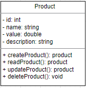

 

<h1>Programa de Bolsas AWS Digital e-commerce –
Turma Java Spring Boot</h1>

 

<h2>Desafio 3 – e-commerce Java</h2>
<h3>Colaboradores</h3>

 

<table>
<tr>
<td align="center">
<a href="https://www.linkedin.com/in/carolaine-machado-a8395a161/">
 
<b>Carolaine Machado</b>
</a>
<td align="center">
<a href="https://www.linkedin.com/in/endrio-alberton/">
 
<b>Endrio Nunes</b>
</a>
</td>
</td>
<td align="center">
<a href="https://www.linkedin.com/in/marcos-abreu-725566206">
 
<b>Marcos Abreu</b>
</a>
</td>
</tr>
</table>

 
---

 

 
#### <h2>Objetivo</h2>
  Este repositório contém o projeto do desafio três, que consiste no desenvolvimento de uma estrutura para um e-commerce, utilizando as tecnologias e conhecimentos aprendidos no curso. 
 
#### <h2>Principais Funcionalidades:</h2>
  - Cadastrar produto
  - Ler produto
  - Atualizar produto
  - Deletar produto 
  - Listar produto

#### <h2>Tecnologias Utilizadas:</h2>
  - Java para o backend
  - MySQL para o banco de dados
  - Draw.io para o diagrama UML
  - Git e GitHub para versionamento.
 
#### <h2>Instruções de Configuração:</h2>
  1. Clone o repositório
  2. Utilize o JDK 11
  3. Executar a tabela do banco de dados
  4. Execute na sua IDE de preferencia
  5. Testar as operações CRUD

#### <h2>Diagrama UML:</h2>
  

  
  

 
## <h2>Conclusão</h2>
